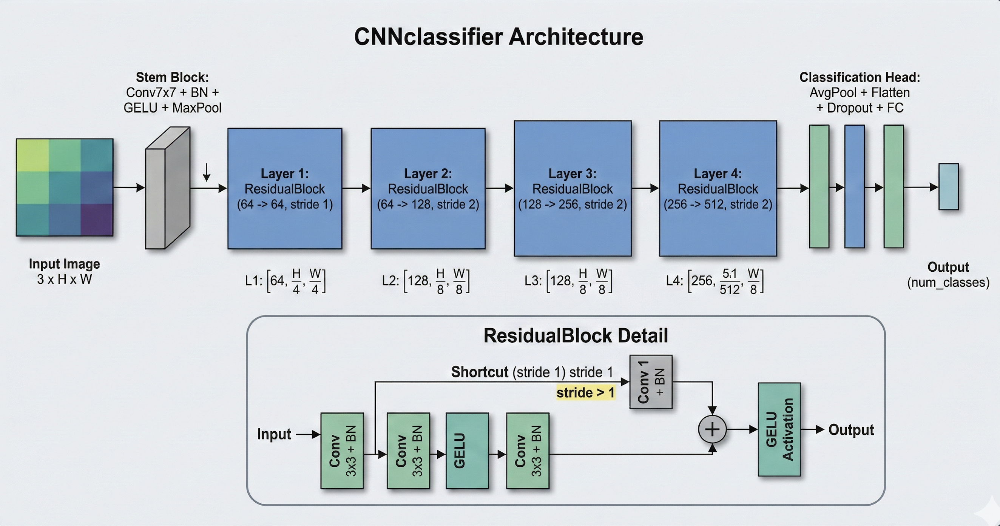

# GalaxyZoo Morphology Classifier

This repository provides a deep learning framework for classifying galaxy morphologies using the Galaxy Zoo dataset. The dataset consists of 17.7k images of galaxies with 10 different morphological classes.

This project investigates how convolutional neural networks behave under real-world image inconsistencies such as scale variation and multiple targets per frame. Using the Galaxy Zoo dataset, we analyze model robustness, feature attribution, and the impact of augmentation strategies on classification performance.

## The data

The dataset used in this project consists of 17,700 images of galaxies, split into 10 labels. Each galaxy is labeled according to its visual shape (or morphology), such as smooth and round, spiral with arms, or irregular and disturbed. These labels were originally provided through the Galaxy Zoo project, where volunteers helped classify galaxies based on their appearance. The goal of this dataset is to teach a model to recognize these visual patterns automatically, similar to how a human would distinguish between different galaxy types by eye.


## Directory Structure

The repository is organized to separate data handling, model architecture, and training logic:

```text
GalaxyZoo_Classifier/
├── configs/
│   └── config.yaml          # Hyperparameters and training configurations
├── data/
│   └── Galaxy10_DECals.h5   # HDF5 dataset containing galaxy images and labels
├── models/                  # Weights, logs, and performance visualizations
│   ├── CNN model/           # Supervised baseline outputs
│   ├── SimCLR training/     # SSL backbone and fine-tuned results
│   └── feature visualizations/ # Visualization of the learned features
├── src/                     # Source code directory
│   ├── architectures.py     # CNN and SimCLR backbone definitions
│   ├── dataset.py           # PyTorch Dataset for .h5 file streaming
│   ├── train.py             # Main script for Supervised and LP-FT training
│   ├── train_ssl.py         # SimCLR contrastive pre-training script
│   ├── utils.py             # Utilities for plotting and reporting
│   ├── visualize_augs.py    # Visualization of data augmentation logic
│   └── visualize_features.py # Feature space analysis
├── Main_analysis.ipynb      # End-to-end comparative analysis
└── requirements.txt         # Project dependencies
```

## Problem Setting

Unlike standard image classification benchmarks, this dataset presents several real-world challenges:

- Target objects (galaxies) vary significantly in size, position and inclination angle relative to observer
- Images may contain multiple galaxies, introducing ambiguity
- Morphological features can be subtle and sensitive to blur and resolution

These factors make the task closer to real-world vision systems, where robustness and feature reliability are critical.


## The Pipeline

The project follows a specific three-step scientific process:

### 1. Baseline CNN Training
A baseline CNN is trained using a specific set of augmentations. The augmentations (rotations, flips, color jitters, crops and gaussian blurs) were designed not only to improve generalization, but also to simulate real-world imaging artifacts such as orientation variance, slight blur, and illumination changes. More details about these augmentations are expressed below. For the baseline CNN training hyperparameters, see the .md file in the CNN model folder.

The architecture was inspired by ResNet with CrossEntropy loss function, and can be seen here:




### 2. SimCLR Pre-training
The SimCLR framework is trained using the **exact same set of augmentations** as the baseline CNN. This ensures a controlled comparison between the supervised baseline and the self-supervised approach. The model learns to map augmented views of the same galaxy to similar points in a latent space. This setup allows us to test whether self-supervised representation learning can improve robustness in the presence of structural ambiguity. As will be discussed below, the SimCLR actually provided worse results than the baseline CNN but manages to focus on the target galaxies better. For the SimCLR training hyperparameters, see the .md file in the SimCLR training folder.

### 3. LP-FT Training Logic
To maximize the utility of the SimCLR-pretrained backbone, the pipeline implements a two-phase **Linear Probing then Full Fine-Tuning (LP-FT)** strategy:

- **Phase 1: Linear Probing (Epochs $0$–20):**
    * The pre-trained backbone is frozen, and only the fully connected (`fc`) classification head is trained.
    * A higher learning rate (starting at $10^{-2}$) is used to "warm up" the head without distorting the pre-trained features.
- **Phase 2: Full Fine-Tuning (Epochs $20+$):**
    * The entire network is unfrozen to allow for end-to-end optimization.
    * The learning rate is reset to a lower base rate (e.g., $10^{-4}$ or $10^{-5}$) to subtly refine the backbone features for morphological classification.
- **Optimization:** Both phases utilize the **AdamW** optimizer combined with a **Cosine Annealing** learning rate scheduler.

In each model's folder there is a .md file with the hyperparameters and augmentations used to train the model.

### 4. Feature visualization

Although it isn't a mathematically rigorous method, feature visualization was used as a diagnostic tool to understand model behavior, identify failure modes, and detect shortcut learning (e.g., reliance on background artifacts instead of galaxy structure). Three visualization methods were used:

- **GradCam** - the most intuitive method, it highlights the regions of the image that the model is focusing on when making a prediction. This was used to verify whether predictions are based on meaningful galaxy structures or background features. It turned out to be especially useful in the SimCLR training process as the algorithm is very sensitive to the choice of augmentations. 
- **FeatureMaps** - this shows the evolution of the feature maps through the layers of the CNN. It helped us visualize the hierarchical feature learning of the model. 
- **Nearest Neighbors** - this shows the most similar images in the dataset to a given image in the learned feature space. It helped us visualize the feature space of the model and identify whether the model was learning meaningful features. Furthermore, it helped us identify 'problematic' classes, such as disturbed galaxies that don't have a clear morphology. 


---


## Training Methods

### Data Augmentation
As mentioned above, the augmentations consisted of rotations, flips, color jitters, crops and GaussianBlurs. 
This set of augmentations was carefully chosen to preserve the morphological features of the galaxies while introducing enough variability to prevent overfitting. 

For example - an aggresive gaussian blurring could blur the spiral arms of the galaxy or a random crop could cut off the galaxy's bulge. On the other hand, gaussian blurring can simulate different observational phenomena, such as atmospheric turbulence or telescope resolution limits.

Since galaxies don't have a prefered oriantaion with respect to us, and are rotationally invariant, we introduces flips and rotations by random angles. This also simulates different viewing angles of the galaxy. Being rotationally invariant isn't a default property of astronomical objects, as many objects are obscured / radiate in a specific directions and thus the symmetry is broken (such as flares in black holes). 

On the other hand, the color of the galaxy is a strong indicator to it's age and star formation rate, so the color jitter is kept minimal to preserve this information. 

The project maintains strict consistency by using identical augmentation parameters for both the baseline supervised run and the SimCLR pre-training. This isolates the effect of the self-supervised objective on the model's final performance.

This highlights a key tradeoff: while augmentations improve generalization, they can also distort fine-grained morphological features. This sensitivity is especially critical in vision systems where small structural details drive classification.

The performed augmentations can be viewed in 'models/augmentations_preview.png'


### Loss Function: NT-Xent
For the SimCLR phase, the project utilizes the **Normalized Temperature-scaled Cross-Entropy (NT-Xent)** loss.
- **Temperature ($\tau$):** Set to 0.1 for high-contrast feature mapping.
- **Optimization:** Calculated across a vectorized $2N \times 2N$ similarity matrix.

### Optimization & Fine-Tuning Schedule
- **Optimizer:** AdamW.
- **Warmup Phase:** Fine-tuning begins with a linear warmup to prevent the pre-trained weights from being distorted by large initial gradients during the switch to supervised classification.
- **Decay:** Cosine decay is applied post-warmup for precision.

---

## Evaluation
Our evaluation is based on performence metrics on the test set for each model, which can be viewed below. The normalized confusion metrices are saved in each models directory. Discussion about the reults can be found in the 'Discussion and Results' section.


### Baseline CNN performence matrix:


| Morphology | Precision | Recall | F1-Score | Support |
| :--- | :---: | :---: | :---: | :---: |
| **Disturbed** | 0.56 | 0.60 | 0.58 | 160 |
| **Merging** | 0.88 | 0.87 | 0.87 | 259 |
| **Round Smooth** | 0.92 | 0.96 | 0.94 | 376 |
| **In-between Smooth** | 0.95 | 0.92 | 0.94 | 319 |
| **Cigar Smooth** | 0.70 | 0.89 | 0.79 | 37 |
| **Barred Spiral** | 0.85 | 0.87 | 0.86 | 315 |
| **Tight Spiral** | 0.77 | 0.82 | 0.80 | 293 |
| **Loose Spiral** | 0.82 | 0.69 | 0.75 | 403 |
| **Edge-on No Bulge** | 0.88 | 0.92 | 0.90 | 197 |
| **Edge-on Bulge** | 0.93 | 0.93 | 0.93 | 302 |
| | | | | |
| **Accuracy** | | | **0.85** | **2661** |
| **Macro Average** | 0.83 | 0.85 | 0.84 | 2661 |
| **Weighted Average** | 0.85 | 0.85 | 0.85 | 2661 |

> **Overall Macro F1-0.8350**

### Finetuned SimCLR model performence matrix:


| Morphology | Precision | Recall | F1-Score | Support |
| :--- | :---: | :---: | :---: | :---: |
| **Disturbed** | 0.47 | 0.53 | 0.50 | 160 |
| **Merging** | 0.83 | 0.86 | 0.84 | 259 |
| **Round Smooth** | 0.91 | 0.93 | 0.92 | 376 |
| **In-between Smooth** | 0.94 | 0.91 | 0.92 | 319 |
| **Cigar Smooth** | 0.62 | 0.89 | 0.73 | 37 |
| **Barred Spiral** | 0.81 | 0.83 | 0.82 | 315 |
| **Tight Spiral** | 0.73 | 0.80 | 0.76 | 293 |
| **Loose Spiral** | 0.76 | 0.60 | 0.67 | 403 |
| **Edge-on No Bulge** | 0.87 | 0.93 | 0.90 | 197 |
| **Edge-on Bulge** | 0.93 | 0.89 | 0.91 | 302 |
| **Accuracy** | | | **0.82** | **2661** |

> **Overall Macro F1-Score: 0.7981**


## Key Insights

- Model performance is strongly affected by scale and localization, with significant degradation when the target galaxy is small or surrounded by other objects
- Feature attribution (Grad-CAM) reveals that errors are frequently associated with attention to background objects rather than the primary target
- Augmentation design plays a critical role in preserving meaningful morphological features
- Self-supervised pretraining (SimCLR) did not improve performance, suggesting that data ambiguity and localization challenges dominate over representation learning limitations

- Detection of Shortcut Learning via Grad-CAM
    - Baseline CNN: While achieving higher accuracy, feature attribution reveals that the model partially relies on boundary artifacts and background signals for its predictions.
    - SimCLR: The SSL backbone demonstrates superior object-centricity, successfully ignoring frame-edge noise that confounded the supervised baseline.
    - Conclusion: The baseline’s "superiority" may be partially inflated by its ability to exploit these shortcuts, whereas SimCLR learns a more physically grounded (though currently less precise) representation. The images are represented below.
 
    
### Model Interpretability & Failure Analysis


---


## Discussion and Results

The two models (Baseline CNN and the SimCLR fine-tuned model) achieved similar results, with the Baseline CNN model outperforming the SimCLR model by a small margin. The two models performed well on most galaxies (around 80%-90% F1 score) but struggled with certain classes, such as disturbed and loose galaxies that don't have a clear morphology. 

The baseline CNN model performed better on those 'harder' classes which gave it the better overall results. The primary challenge was not model capacity, but data inconsistency. In many cases, galaxies were small or surrounded by additional objects, causing the model to attend to incorrect regions and leading to systematic misclassification.

These results indicate that performance is bottlenecked by object localization and data ambiguity rather than model architecture, suggesting that improvements would require better target isolation (e.g., cropping or detection) rather than more complex models. This behavior mirrors real-world vision systems, where failures are often driven by data ambiguity and scene complexity rather than model capacity.


## Steps for improvments

As discussed above, the main challenge is the data itself. As training a more complex network such as a ViT could enhance the model's ability to capture global context, it is unlikely to solve the fundamental issue of background interference. A stricter and more robust data augmentation pipeline, or a more sophisticated object detection preprocessing step, would likely yield more significant improvements.


